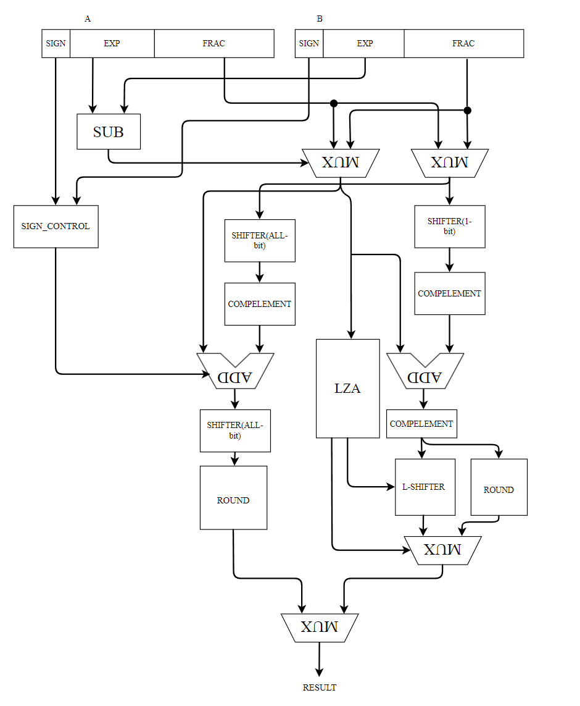
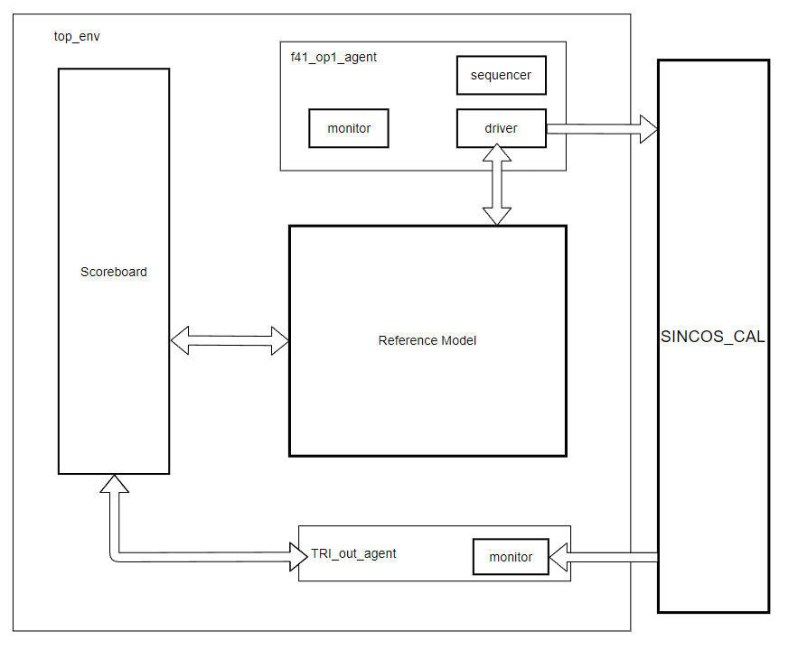

# 整体架构

# 子模块定义

## 1.Pre-MAP

### 1.1 总体说明

预映射模块，在实现算法的过程中，前期处理主要是进行计算区域的映射，对于输入需要限定在$x\in[0,1]$，并将其压缩在$[0,0.125]$区间范围内。在进行压缩时，首先要选择模式的压缩，以及压缩的计算模式、压缩的偏置数（bias）。

pre-mapping module.For the impelement of design, we need to compress the district of caculation. Firstly, the input number should be confined in [0,1],then being processed by this module. the input will be mapped to the [0,0.125]

其总体模块定义如下：

经过运算区域的压缩和变换，cos和sin的计算模式也可能发生变化

### 1.2 总体架构

总体架构如图，注意，float hub并不是实际模块，只是连线上的操作，为了画图简单。

其中先利用exp与frac位进行映射区域的编码，映射区域总共有8个区域，4种偏置数。其种有一种区域不需要进行额外的变换与压缩，直接可以输入MUX进行结果的选择。另一条较为复杂的路径则是需要进行压缩与映射，对映射区域进行编码后，将编码后的bias相关信号送入bias解码模块，利用编码进行还原，还原出完整的bias的浮点数格式，送入浮点加法器进行区域的映射。区域如下：

## 2. ADDR_DEC

### 2.1 总体说明

译码模块需要将输入的浮点数数据映射到其对应的系数表中，根据系数个数84，总共需要7位地址码，可以分为四段，如果直接根据小数对其进行译码，复杂程度很高，电路规模会很大。为了将其进一步划分，减少复杂程度，可以对其进行段首地址与段偏移地址的译码。各段如下：

可以根据段数分析，其最大偏移地址为48，则需要6个位宽的偏移地址。

log:4月7日

在新的构建中，重新规划这一部分的区域

| Low           | Up            | Segment                     | D             | n    |
| ------------- | ------------- | --------------------------- | ------------- | ---- |
| 0             | $2^{-19}$   | $in:x,out:2\pi x$         |               |      |
| $2^{-19+n}$ | $2^{-18+n}$ |                             | $2^{-19+n}$ | 0~9  |
| $2^{-9}$    | $2^{-3}$    | $2^{-9}+(n-1)D,2^{-9}+nD$ | $2^{-9}$    | 1~63 |
|               |               |                             |               |      |
|               |               |                             |               |      |

这样的好处在于，保证了每次计算x-x_i的时候，这两个数一定在同一个指数级别上，也就是在进行加减法的时候，最后完成的是一个同级别的浮点减法，这个减法器就不用全部流程的浮点加减法了，一定是位于close路径上，而且不需要提前计算指数差。指数差等于0的加法也不会出现舍入的情况，也就是直接对结果进行规格化左移就可，延迟几乎就等于一个32位的定点加法器，加上一个8位的定点加法器（指数计算）

l

### 2.1 总体架构

\

## 3.BIAS_DEC

主要恢复偏移数x_i，其输入和ADDR_DEC以及中间的段地址信号可以复用。

## 4. FADD

### 4.1 总体结构及说明

采用双路径算法，其中对于双路径算法进行进一步优化，通过分析LZA的结果，可以判断出那些不需要舍入，进而进一步优化逻辑。

## 5. LZD(leading zero detector)

### 5.1 总体架构及说明

对于非2^n次方bit的信号可以进行如下的方法进行前导零检测，每一个模块都用二叉树结构进行检测。

## 6. LZA(leading zero anticipator)

### 6.1 总体架构以及说明

前导零预测包含两部分，前导零预测，前导零纠错，其整体结构如下：

## 7. FMA(Fused Multiply-Add Unit)

    主要是进行乘法加法的运算,接口定义与FADD类似。

# 验证环境的搭建

验证环境的搭建主要是各个组件的实现，为了尽可能复用各个组件，在设计时尽可能细颗粒度实现各个组件，由于设计上输入格式主要是规定的浮点数，可以把各个模块分为三类，第一类是：INPUT 2 OUTPUT 1，这一类是FADD、FMUL等单元，第二类是INPUT 1 OUTPUT1，这类包括了Pre_MAP以及整个单元，第三类则是FMA，也就是INPUT 3 OUTPUT 1。

## 组件实现

组件实现主要是设计最核心的几个类，也就是transaction类，以及reference model类

### 1、f_transaction类

    继承于uvm_sequence_item，主要是作为最基本的数据单元。其成员变量以及主要方法如下：

 

其中主要是构建了制定浮点数格式f41的各个数据，以及转换成64位浮点数类型后的比特级数据

主要方法如上，主要是进行transaction的初始化，以及获取该类的各个值，同时利用constraint块，可以对产生的浮点数进行更好的受约束的随机化。

### 2、Reference Model

继承于component。主要是完成数据的对比与转化。将输入的数据转换real类型后，直接利用内置的三角函数、加法、乘法加法运算符得到对应的结果，并将结果再次转化为输入格式的浮点数，交付给scoreboard

主要方法如下：

如图设计了，标准加、标准乘的方法进行生成标准数据。

## 各模块验证环境

### 1.FADD_ENV

### 2.FMA_ENV

### 3.TOP_ENV

## Optimize

WIDTH : C0 :

log:4月6日

在新的构建中，重新规划这一部分的区域

| Low           | Up            | Segment                     | D             | n    |
| ------------- | ------------- | --------------------------- | ------------- | ---- |
| 0             | $2^{-19}$   | $in:x,out:2\pi x$         |               |      |
| $2^{-19+n}$ | $2^{-18+n}$ |                             | $2^{-19+n}$ | 0~9  |
| $2^{-9}$    | $2^{-3}$    | $2^{-9}+(n-1)D,2^{-9}+nD$ | $2^{-9}$    | 1~63 |
|               |               |                             |               |      |
|               |               |                             |               |      |

这样的好处在于，保证了每次计算x-x_i的时候，这两个数一定在同一个指数级别上，也就是在进行加减法的时候，最后完成的是一个同级别的浮点减法，这个减法器就不用全部流程的浮点加减法了，一定是位于close路径上，而且不需要提前计算指数差。指数差等于0的加法也不会出现舍入的情况，也就是直接对结果进行规格化左移就可，延迟几乎就等于一个32位的定点加法器，加上一个8位的定点加法器（指数计算）

优化系数表后发现，最多的区间大小为63,因此可以采用一个128x*COF_WIDTH，加上一个32x*COF_IDTH的单元，压缩了ROM的大小，同时，想比之前的区间说，仅有2种模式的区间划分，第一种以指数步进，第二种以固定区间大小步进，可以仅仅通过针对小数位和指数位的移位器来实现decode

## 关于是否会存在出现尾数等于0导致失效的演算

已知条件如下

$$
Y=C0+D(C1+(C2+D*C3)) \\exp(D)\in[-31,-n),n\in[9,19]
$$

$$
let:e_d =exp(D),e_i=exp(C_i)
$$

考虑第一级计算：

$$
M=C2+D*C3 \\IF:M==0\\ e_{2}==exp(D*C3) \\ e_2<-n-e_3\\e_2>-31-n;

$$

所以，可以得到：

$$
e_2-e_3<-n,e_2>-31-n
$$

通过计算发现，对于正弦函数而言：

$$
min(e_2-e_3)==(-n+2)
$$

对于余弦函数而言

$$
min(e_2-e_3) == (-n+12)
$$

由于：

$$
n>0
$$

第一级不会出现0的情况

如果第一级不出现0，则满足：

$$
e_2-e_3>=-n,\ or:e_2<-31-n

$$

由于：

$$
e_2\in[-12,4]
$$

所以只可能是第一种情况

$$
e_2-e_3>=-n,so,e_2>=e_3-n

$$

在这种情况下，对于浮点数减法而言：

计算后结果的：

$$
e_{M0} \in[e_2-31,e_2]
$$

$$
e_1-e_{M0}<-n,e_1>-31-n\\ 
$$

    

观察发现，正弦函数满足：

$$
e_2== -n+7(n>9);e_2 == -n+\{7,8,9,10,11 \}
$$

余弦函数：

$$
e_2==4,3 \\max{[e_1+n]} == -9+2 =7 \\ 则该级可能出现0 的情况。
$$
